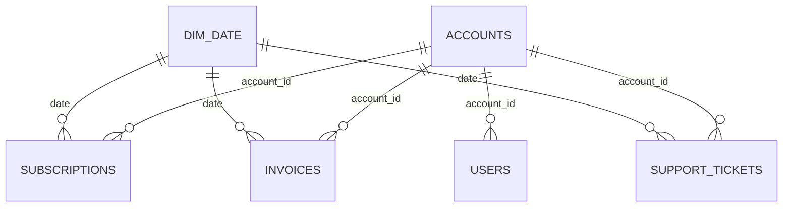

# B2B SaaS Customer Retention & Churn Analysis

An end-to-end analysis of customer retention and revenue churn for a B2B SaaS company with 1,200 commercial accounts and $971.4K in Monthly Recurring Revenue (MRR). Five relational Kaggle datasets were cleaned in Excel Power Query, modelled as a star schema in Power BI, and presented in a 2-page interactive dashboard. Key metrics were then cross-checked in MySQL with independent SQL queries.

---

## 📌 Project Overview

Retaining existing customers is critical for a B2B SaaS business because recurring revenue compounds only when accounts stay and pay. This project looks at where the company is losing revenue, which customer segments are most exposed, and which billing, support and adoption signals sit alongside churn risk.

The analysis covers three areas:

- **Revenue retention:** MRR by plan, churned vs. at-risk (past due) MRR, and churn by industry.
- **Operational health:** support volume, resolution time, CSAT, overdue invoices and seat utilization.
- **Validation:** SQL queries in MySQL that reproduce key dashboard figures.

**Workflow:** Kaggle CSVs → Excel / Power Query → Power BI star schema → 2-page dashboard → MySQL → SQL validation

---

## 🎯 Business Objectives

- Identify where recurring revenue is being lost, by plan, industry and company size.
- Separate permanent churn from revenue still at risk (past-due accounts).
- Find the industries with the highest churn rate and the largest dollar loss.
- Locate overdue invoice balances and see which customer segments hold them.
- Assess support performance (volume, resolution time, CSAT) and product adoption (seat utilization).
- Turn the findings into practical retention actions.

---

## 📊 Dataset

**Source:** Kaggle B2B SaaS dataset (5 relational CSV files). *Add dataset link here.*

| Table | Description | Records |
| ----- | ----------- | ------: |
| `accounts` | Company master data: account ID, company name, industry, country, employee count, plan tier, company size | 1,200 |
| `subscriptions` | Contract data: seats, MRR, status (active / churned / past_due), start and end dates, churn flag | 1,200 |
| `invoices` | Billing records: amount, invoice date, payment status (paid / open / void / uncollectible), unpaid flag | 14,500 |
| `support_tickets` | Support tickets: category, priority, resolution hours, CSAT score, ticket status | 5,600 |
| `users` | Provisioned users per account, with roles (Admin / Member / Viewer) | 21,884 |
| **Total** | | **44,384** |

---

## 🛠️ Tools & Technologies

| Layer | Tools |
| ----- | ----- |
| Data preparation | Microsoft Excel, Power Query |
| Data modelling & BI | Power BI Desktop, DAX, star schema design |
| Validation | MySQL, MySQL Workbench, SQL (joins, aggregations, `CASE WHEN`, CTEs) |

---

## 🔄 Data Preparation & Cleaning

All five CSV files were cleaned in **Excel Power Query** before being loaded into Power BI.

- Handled null values across the datasets.
- Verified and corrected data types (dates, numeric fields, flags).
- Added fields used for analysis, visible in the final model:
  - `churn_flag` (subscriptions)
  - `is_unpaid` (invoices)
  - `Priority_Order` (support tickets, for sorting priority levels)
- Built a dedicated `Dim_Date` table (Date, Month, MonthNumber, Quarter, Year) to support time filtering.
- Kept `account_id` consistent across all tables so every table joins cleanly to `Accounts`.

The SQL validation scripts also handle mixed-case status values (for example `'open'` / `'Open'`, `LOWER(priority)`) so that results match the Power BI logic.

---

## 🧩 Data Modeling

The Power BI model is a **star schema** centred on `Accounts` and `Dim_Date`. Every relationship is **one-to-many (1:\*)**, which keeps DAX measures fast and avoids circular relationships.

| Role | Tables |
| ---- | ------ |
| Fact tables | `Subscriptions` (MRR, seats, churn), `Invoices` (billing and collections), `Support_Tickets` (SLA and CSAT) |
| Dimension tables | `Accounts` (industry, plan, company size), `Dim_Date` |
| Supporting table | `Users` (user-level adoption data, related to `Accounts`) |




**Why this design:** one account dimension filters all fact tables, so the Plan, Industry, Company Size and Year slicers apply consistently across every visual on both pages.

---

## 📈 Power BI Dashboard

The dashboard has **2 interactive pages**. Both share the same slicers: **Plan, Industry, Company Size, Year**.

### Page 1 — Executive Revenue Retention & Churn Overview


**Purpose:** show how much recurring revenue is secure, lost or at risk, and where.

**KPIs:** Total Portfolio MRR, Lost MRR, Customer Churn Rate %, Total Paying Accounts

**Visuals:**
- Total vs Lost MRR by Plan
- MRR at Risk Breakdown (donut)
- Churn Rate by Industry
- Lost Revenue by Industry & Plan

**Business questions answered:**
- Which plan tiers generate the revenue, and where is lost revenue concentrated?
- How much MRR is active, churned or past due?
- Which industries have the highest churn rate?
- Which industries cause the largest dollar loss?

### Page 2 — Customer Health & Churn Risk Diagnostics


**Purpose:** show the operational signals around churn risk: support performance, overdue billing and product adoption.

**KPIs:** Seat Utilization %, Avg CSAT Score, Overdue Balance, Avg Resolution Time (Hrs)

**Visuals:**
- Ticket Volume by Category & Priority
- Overdue Balance by Company Size
- Support Ticket Resolution Status
- Seat Utilization by Plan

**Business questions answered:**
- Which support categories generate the most tickets and urgent escalations?
- Where is the overdue invoice balance concentrated?
- How much of the support queue is resolved vs. still open?
- Are customers using the seats they bought, by plan?

---

## ❓ Business Questions Answered

1. Which subscription plans drive revenue, and where is lost revenue concentrated?
2. What share of MRR is secure, permanently churned, or at risk through failed payments?
3. Which industries have the highest customer churn rates?
4. Which industries cause the largest financial loss, and how does that differ from churn rate?
5. Which support categories generate the most volume and urgent escalations, and which are slowest to resolve?
6. Where is the overdue invoice balance concentrated?
7. What share of support tickets is resolved vs. still open?
8. Are customers actively using the seats they purchased, across plan tiers?

---

## 📊 Key KPIs

| KPI | Value | Definition | Business Purpose |
| --- | ----: | ---------- | ---------------- |
| Total Portfolio MRR | $971.4K | Total monthly recurring revenue across all 1,200 accounts | Baseline for measuring revenue exposure |
| Lost MRR | $91.8K | MRR from churned accounts ($58.5K) plus past-due accounts ($33.3K) | Quantifies revenue lost or at immediate risk |
| Customer Churn Rate % | 10.33% | Churned accounts ÷ total accounts (124 of 1,200) | Headline retention metric |
| Total Paying Accounts | 1,200 | Total account count in the portfolio | Denominator for account-level metrics |
| Seat Utilization % | 77.8% | Share of purchased seats assigned to users | Adoption signal for expansion and downgrade risk |
| Avg CSAT Score | 4.03 / 5 | Average satisfaction score on support tickets | Customer sentiment on support |
| Overdue Balance | $739.60K | Unpaid balance on open invoices (void invoices excluded) | Measures collections exposure |
| Avg Resolution Time | 40.8 hrs | Average hours to resolve a support ticket | Support efficiency |

---

## 🔍 Key Business Insights

**1. Revenue is concentrated in Business, Growth and Enterprise, and so is the dollar loss.**
- **Finding:** Active MRR is $431.3K (Business), $235.7K (Growth), $184.1K (Enterprise) and $28.5K (Starter). Lost MRR is $21.8K, $18.8K, $15.0K and $2.9K respectively. Starter is 524 of 1,200 accounts (about 44%) but a small share of lost revenue.
- **What it means:** Churn in the higher tiers costs far more than churn in Starter.
- **Why it matters:** Retention effort should be weighted by revenue, not by account count.

**2. $33.3K of MRR is past due and could still be recovered.**
- **Finding:** 90.55% ($880K) of MRR is active, 6.03% ($59K) has churned and 3.43% ($33K) is past due.
- **What it means:** Past-due accounts have not yet churned, so this revenue is still in play.
- **Why it matters:** Recovering failed payments is a lower-effort retention lever than winning back cancelled accounts.

**3. The industry with the highest churn rate is not the one with the largest loss.**
- **Finding:** Retail (12.8%) and Healthcare (11.9%) have the highest churn rates, against a 10.33% average. Software (10.5%) causes the largest dollar loss, about $35K of lost MRR, mostly from Enterprise and Business plans. Retail is about $14K.
- **What it means:** Account-level churn and revenue-weighted churn tell different stories.
- **Why it matters:** Prioritising by churn rate alone would misdirect retention effort.

**4. Education (8.0%) and Financial Services (8.9%) are the most stable industries.**
- **Finding:** Both sit below the 10.33% average.
- **What it means:** These segments retain better than the portfolio overall.
- **Why it matters:** They are useful benchmarks for what healthy retention looks like.

**5. Overdue invoices are concentrated in Enterprise companies.**
- **Finding:** Enterprise holds $524.35K (70.9%) of the $739.60K overdue balance across 157 open invoices (average ≈ $3,340). Mid-Market holds $192.73K and Small holds $22.52K.
- **What it means:** A small number of large invoices drives most of the collections exposure.
- **Why it matters:** Collections effort aimed at large Enterprise invoices has the biggest cash impact.

**6. Integrations and Billing are the main support pain points.**
- **Finding:** In the validated resolved-ticket sample, Integrations has the most tickets (1,171) and the most urgent ones (101), followed by Bug Reports (1,046 tickets, 76 urgent). Billing is the slowest category (42.8 hrs average) and has the lowest CSAT (3.96).
- **What it means:** Billing tickets are both slow to close and the least satisfying for customers.
- **Why it matters:** Billing support overlaps with the overdue and past-due revenue issues above.

**7. Support backlog is small, and seat utilization is fairly even across plans.**
- **Finding:** 91.59% of tickets are resolved and 8.41% are open. Seat utilization is 84.7% (Business), 82.3% (Starter), 80.2% (Enterprise) and 78.6% (Growth), against 77.8% overall.
- **What it means:** Neither the support queue nor seat adoption shows an acute problem at portfolio level.
- **Why it matters:** The revenue risk sits mainly in billing and high-tier churn, with account-level adoption gaps still worth monitoring.

---

## 🗄️ SQL Validation

After the Power BI analysis, the cleaned data was loaded into **MySQL** and queried in **MySQL Workbench** to reproduce key dashboard figures independently of DAX. The queries use joins, conditional aggregation, `LOWER()` / `IN` for status handling, and CTEs.

| # | Validation Script | What It Validates |
| - | ----------------- | ----------------- |
| 1 | Revenue and Churn by Plan | Active MRR and lost MRR per plan tier (Chart: Total vs Lost MRR by Plan). Churned MRR sums to $58.5K and active MRR to about $880K, matching the dashboard. |
| 2 | Overdue Invoices by Company Size | Open invoice count, total overdue balance and average invoice size by company size. Totals $739,597.81, matching the $739.60K KPI. |
| 3 | Support Ticket SLA & CSAT by Category | Ticket count, urgent tickets, average resolution hours and average CSAT per category, for resolved tickets. |
| 4 | High-Risk Account Early Warning (CTEs) | Combines seat utilization, overdue balance and open urgent tickets for active and past-due accounts, ranked by MRR. Extends the dashboard into an account-level watchlist. |

Matching the SQL output to the dashboard confirms that the DAX measures, the relationships and the filter logic produce the same numbers as direct queries on the underlying data.

---

## 🔁 End-to-End Workflow

```text
Kaggle Datasets (5 CSV files)
        ↓
Excel / Power Query
        ↓
Data Cleaning & Transformation
        ↓
Power BI Star Schema (facts + dimensions + Dim_Date)
        ↓
DAX Measures & KPI Development
        ↓
2-Page Interactive Dashboard
        ↓
MySQL (cleaned data loaded)
        ↓
SQL Validation Queries
        ↓
Validated Insights & Recommendations
```

---

## 💡 Business Recommendations

| Finding | Recommendation | Expected Business Benefit |
| ------- | -------------- | ------------------------- |
| $33.3K of MRR is past due | Add automated payment retries and in-app payment reminders | Recover part of the at-risk MRR before it becomes churn |
| Lost MRR is concentrated in Business, Growth and Enterprise | Prioritise proactive check-ins for high-MRR accounts, using the SQL watchlist (Script 4) | Earlier intervention on the accounts where churn costs the most |
| $524.35K of overdue balance sits with Enterprise | Send invoices earlier and confirm vendor and procurement requirements up front | Faster collection of large balances and better cash flow |
| Integrations has the most tickets and urgent escalations | Review the most common integration issues in an engineering sprint | Fewer urgent tickets and less support load |
| Billing tickets are slowest (42.8 hrs) and lowest CSAT (3.96) | Set a faster resolution target for billing issues | Better satisfaction on an issue linked to payment risk |
| Retail and Healthcare churn above average | Review why these segments cancel and tailor onboarding and success plans | Lower account churn in the highest-churn industries |

*These recommendations come from descriptive analysis of the dataset. They show where to focus, not proven causes of churn.*

---

## 📁 Project Structure

```text
B2B-SaaS-Customer-Retention-Churn-Analysis/
│
├── data/
│   └── raw/                  # accounts, subscriptions, invoices, support_tickets, users (CSV)
├── powerbi/
│   └── B2B_SaaS_Customer_Churn_Analysis.pbix
├── dashboard/
│   └── B2B_SaaS_Customer_Churn_Analysis.pdf
├── sql/
│   ├── 01_revenue_churn_by_plan.sql
│   ├── 02_overdue_invoices_by_company_size.sql
│   ├── 03_support_sla_csat_by_category.sql
│   └── 04_high_risk_accounts_cte.sql
├── report/
│   └── B2B_SaaS_Customer_Retention_Analysis_Project_Report.docx
├── images/
│   ├── star-schema-model.png
│   ├── dashboard-page-1.png
│   └── dashboard-page-2.png
└── README.md
```

---

## 🧠 Analytical Skills Demonstrated

- **Data cleaning and preparation:** Power Query, null handling, data-type validation
- **Data transformation:** derived flags, a date dimension, consistent keys across five tables
- **Data modelling:** star schema design with fact and dimension tables and 1:\* relationships
- **DAX and KPI development:** churn rate, MRR, overdue balance, seat utilization, CSAT and resolution-time measures
- **Dashboard development:** a 2-page Power BI report with cross-filtering slicers
- **Business analysis:** revenue-weighted vs. account-weighted churn, revenue at risk, collections exposure
- **SQL:** joins, conditional aggregation, CTEs, case-insensitive status handling
- **Data validation:** reconciling Power BI results against independent MySQL queries
- **Insight generation:** turning findings into specific, prioritised recommendations

---

## 🚀 Project Highlights

- **End-to-end workflow:** ingestion, cleaning, modelling, dashboarding and SQL validation in one project.
- **Multiple related datasets:** five tables and 44,384 records joined through a common account key.
- **Star schema model:** three fact tables and a shared account and date dimension supporting both dashboard pages.
- **Business-focused dashboard:** two pages covering revenue retention and customer health, with eight business questions answered.
- **Independent SQL validation:** MySQL queries reproduce dashboard totals, including $58.5K churned MRR, $739.6K overdue balance and ticket-level SLA metrics.
- **Actionable output:** findings tied to specific recommendations, including an account-level high-risk watchlist built with CTEs.

---

## 👤 Author

**Mukteswar Nayak**

GitHub: [your GitHub profile]
LinkedIn: [your LinkedIn profile]
